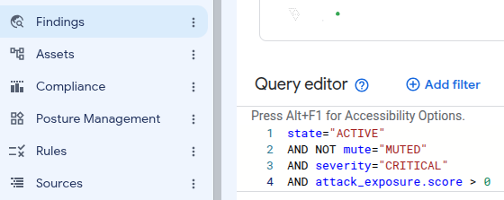
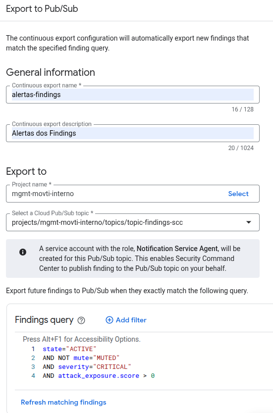

```Configurar filtro para exportar findings para pub/sub```

```
Após criar o filtro selecione a opção "Export -> Cloud Pub/Sub"
Preencha as informações para criar a exportação:
Export name:
Descrição:
Projeto name: "Projeto onde ficara o pub/sub"
Select a Cloud Pub/Sub topi: "Caso não estaja criado, crie o topico"
```


```Criação da function```
```
Ajuste o script-function.sh com as informações do seu ambiente
```